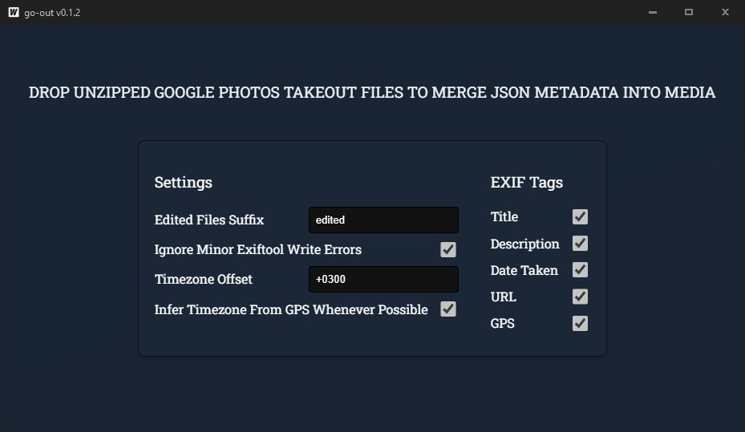

## go-out

## Features
* Small, portable single executable
* Simple, functional GUI
* Uses the [ExifTool by Phil Harvey](https://exiftool.org/) to work with EXIF
* Choose which EXIF tags to merge into files
* Saves settings and window position
* Set `Edited files suffix` to help the app recognize edited files and process them too
* If metadata contains GPS, by checking `Infer Timezone From GPS` the app will try infer timezone and use it when writing exif date

# Ensure that [ExifTool by Phil Harvey](https://exiftool.org/) is available in your PATH or the current working directory.

## FAQ
#### I've used Google Takeout to export my Google Photos data, there are some Json files, should i use this app?

It depends.

First, it is a common misconception that Google Takeout erases EXIF data. When you upload a file to Google Photos, it reads the file’s metadata and EXIF information, then saves them as its metadata. If you then modify the metadata (like date, location, or description) within Google Photos, those changes are not written to the file itself but are stored separately.

When you export your data using Google Takeout, the file itself is exported unmodified, in the same state, as it was originally uploaded (unless you chose compression). The Google Photos metadata, including any changes you made, will be exported separately as JSON files.

So, if you’ve updated metadata in Google Photos and want those changes written directly into your files, this tool is perfect for that. However, if you didn’t modify any metadata in Google Photos or don’t care about preserving it, you can simply delete the JSON files and ignore them.

#### What file formats are supported?

Most popular image and video formats are.
Compatibility is reliant on exiftool, you can see the full list here https://exiftool.org/#supported

#### Where config is stored?

The config file is stored in `%userprofile%\.config\go-out\config.yaml`
It is used to store app's settings and window position

#### What is `Edited files suffix` for?

If you edit a file in Google Photos, it will not replace the original, and they both will be exported as `filename.jpg` and `filename-edited.jpg`.
That `edited` word will depend on the language used when creating the export.

## How to build
Follow the [wails3 installation guide](https://v3alpha.wails.io/getting-started/installation/)

### Built With
[Wails3](https://wails.io/)  A framework for creating desktop apps using Go and web technologies.  
[ExifTool](https://exiftool.org/)  A tool for reading and writing EXIF data.  
[go-exiftool](https://github.com/barasher/go-exiftool)  A Go library for easily interacting with ExifTool.  
[latlong](https://github.com/bradfitz/latlong)  A Go library for mapping GPS coordinates to timezones.  
[gjson](github.com/tidwall/gjson)  A Go library for parsing JSON.  
[koanf](https://github.com/knadh/koanf)  A Go library for managing configurations.  
